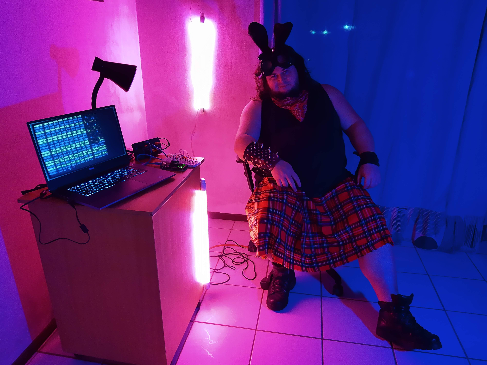
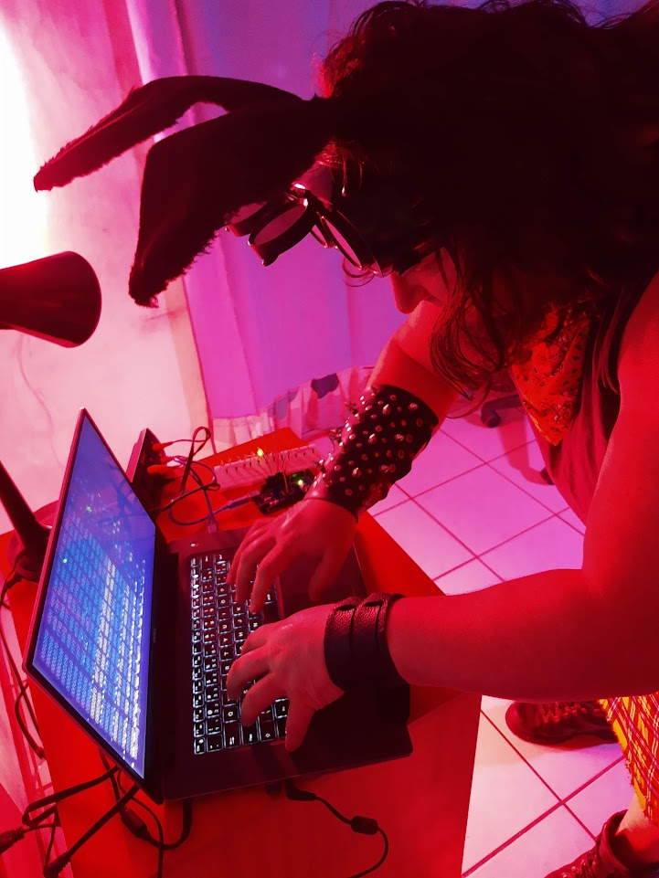

# Hi, I'm Saulo 👋

  

---

I'm **Saulo Popov Zambiasi**, professor of Computer Science at **Unisul** and **Unicesusc** (Brazil).  
I’m passionate about teaching, research, and software development.

### Teaching
I have taught a wide range of subjects, including:
- Programming (C/C++, Go, Python, Kotlin, Java, PHP, Arduino, Flutter, Object Pascal, etc.)
- Artificial Intelligence & Artificial Neural Networks
- Data Structures and Algorithms
- Digital Games (Development, Math & Physics for Games)
- Software Engineering & Distributed Systems
- Computer Graphics, Operating Systems, Databases, Linux
- Independent Cinema and Cyberart

  

  <h3>Research</h3>
  <ul>
    <li>Published in conferences, journals, and book chapters.</li>
    <li>Supervised research projects and theses at undergraduate, specialization, master's and doctoral levels.</li>
    <li>Research areas: <strong>Artificial Intelligence, Digital Assistants, Digital Games, Automation Systems, and Cyberart</strong>.
    </li>
  </ul>
  <h3>Development</h3>
  <ul>
    <li>25+ years of experience in software development.</li>
    <li>Worked with C/C++, Python, Go, Java, Kotlin, PHP, Flutter, Godot, and more.</li>
    <li>Creator of the <strong>Arisa Nest Virtual Assistant</strong> platform (PaaS).</li>
  </ul>

<!---
saulopz/saulopz is a ✨ special ✨ repository because its `README.md` (this file) appears on your GitHub profile.
You can click the Preview link to take a look at your changes.
--->
