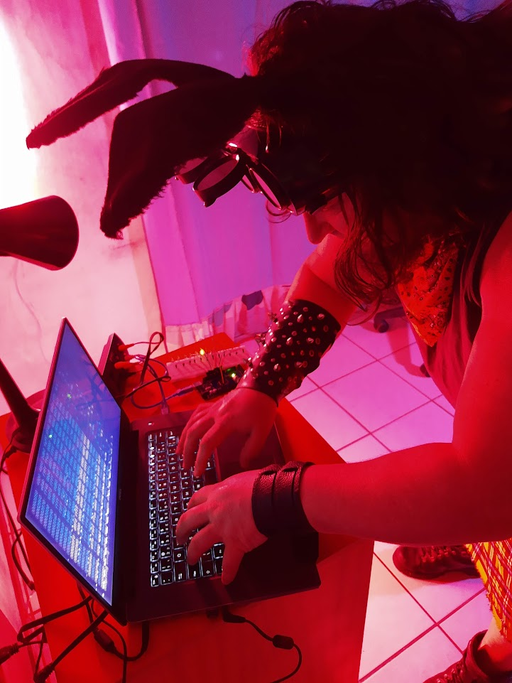

# Hi, I'm Saulo 👋

  

  

## About Me

I'm **Saulo Popov Zambiasi**, professor of Computer Science at **Unisul** and **Unicesusc** (Brazil).
I'm passionate about teaching, research, and software development.

### Teaching

I have taught a wide range of subjects, including:

* Programming (C/C++, Go, Python, Kotlin, Java, PHP, Arduino, Flutter, Object Pascal, etc.)
* Artificial Intelligence & Artificial Neural Networks
* Data Structures and Algorithms
* Digital Games (Development, Math & Physics for Games)
* Software Engineering & Distributed Systems
* Computer Graphics, Operating Systems, Databases, Linux
* Independent Cinema and Cyberart

### Research & Development

* Published in conferences, journals, and book chapters.
* Supervised research projects and theses at undergraduate, specialization, master's and doctoral levels.
* Research areas: **Artificial Intelligence, Digital Assistants, Digital Games, Automation Systems, and Cyberart**.
* 30+ years of experience in software development (C/C++, Python, Go, Java, Kotlin, PHP, Flutter, Godot, and more).
* Creator of the **Arisa Nest Virtual Assistant** platform (PaaS).

 

> I seek retrofuturism on the digital frontier: the nostalgia for a future where the vast digital network could have fulfilled its promise. A world of hope, shared knowledge, and people helping each other toward a more just future.

  

  📧 saulopz@gmail.com &nbsp;|&nbsp;
  🌐 <a href="https://saulo.arisa.com.br">saulo.arisa.com.br</a> &nbsp;|&nbsp;
  🐘 <a href="https://cortexplant.com/@saulopz">@saulopz@corteximplant.com</a> &nbsp;|&nbsp;
  💼 <a href="https://linkedin.com/in/saulo-popov-zambiasi">LinkedIn</a>

